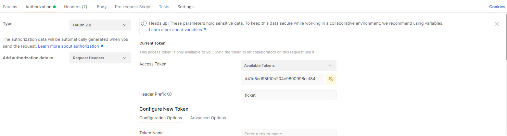

# Read ME
## Install Project

Create a new project folder. <br>
Now we need to go in the project folder.
```bash
cd projectFolder
```

Now we need to pull the project from Git.


Then we install the dependencies.
```bash
composer install
```

After we install everything we need, we can start the Backend.
```bash
php artisan serve
```

## Api's 

### Authentication
If you want to send a request, you need to set up a token. <br>
The token can be change in the folder - /config/app.php.

- OAuth 2.0
- Available Tokens: 
  - d41d8cd98f00b204e9800998ecf8427e
- Header Prefix:
  - ticket

;

### Start

#### Create database values:
```
http://127.0.0.1:8000/api/v1/test/start
```

### Ticket

#### Create ticket
```
http://127.0.0.1:8000/api/v1/ticket/create
```

#### Example Json:
```json
{
    "title": "Test",
    "description": "asd",
    "due_date": "",
    "status_id": 1
}
```

#### Update Ticket
```
http://127.0.0.1:8000/api/v1/ticket/update
```

#### Example Json:
```json
{
    "id": 5,
    "title": "Pdf-Tool",
    "description": "Sample Text",
    "due_date": "2020-09-30",
    "status_id": 4
}
```

#### Delete ticket
```
http://127.0.0.1:8000/api/v1/ticket/delete
```

#### Example Json:
```json
{
    "id": 5
}
```

#### Change ticketstatus
```
http://127.0.0.1:8000/api/v1/ticket/changeStatus
```

#### Example Json:
```json
{
    "ticket_id": 3,
    "status_id": 3
}
```

#### Assign user to ticket
```
http://127.0.0.1:8000/api/v1/ticket/assignUser
```

#### Example Json:
```json
{
    "ticket_id": 1,
    "user_id": 1
}
```

#### Unassign user from ticket
```
http://127.0.0.1:8000/api/v1/ticket/unassignUser
```

#### Example Json:
```json
{
    "ticket_id": 4,
    "user_id": 1
}
```

#### Add relation to tickets
```
http://127.0.0.1:8000/api/v1/ticket/addRelation
```

#### Example Json:
```json
{
    "parentticket_id": 4,
    "childticket_id": 2,
    "ticketrelation_id": 2
}
```

#### Remove relation from tickets
```
http://127.0.0.1:8000/api/v1/ticket/removeRelation
```

#### Example Json:
```json
{
    "parentticket_id": 1,
    "childticket_id": 3
}
```

### Status
#### Create new status
```
http://127.0.0.1:8000/api/v1/status/create
```

#### Example Json:
```json
{
    "status_name": "work in progress"
}
```

#### Remove new status
```
http://127.0.0.1:8000/api/v1/status/delete
```

#### Example Json:
```json
{
    "id": 4
}
```

#### Get all status
```
http://127.0.0.1:8000/api/v1/status/all
```

### User
#### Create a new user
```
http://127.0.0.1:8000/api/v1/user/create
```

#### Example Json:
```json
{
    "name": "alex",
    "email": "test@web.de",
    "password": "hallo"
}
```

#### Update a user
```
http://127.0.0.1:8000/api/v1/user/update
```

#### Example Json:
```json
{
    "id": 1,
    "name": "John",
    "email": "someothertest@web.de",
    "password": "hallo"
}
```

#### Delete a user
```
http://127.0.0.1:8000/api/v1/user/delete
```

#### Example Json:
```json
{
    "id": 5
}
```


### Relation
#### Create a new relation
```
http://127.0.0.1:8000/api/v1/relation/create
```

#### Example Json:
```json
{
    "relation_name": "blocked"
}
```

#### Delete a relation
```
http://127.0.0.1:8000/api/v1/relation/delete
```

#### Example Json:
```json
{
    "id": 4
}
```

#### Get all relation's
```
http://127.0.0.1:8000/api/v1/relation/all
```